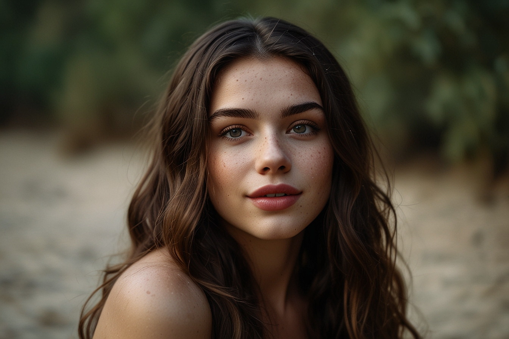
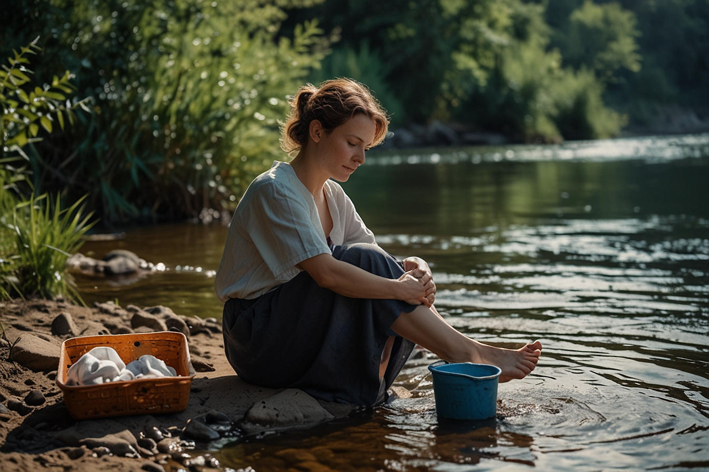
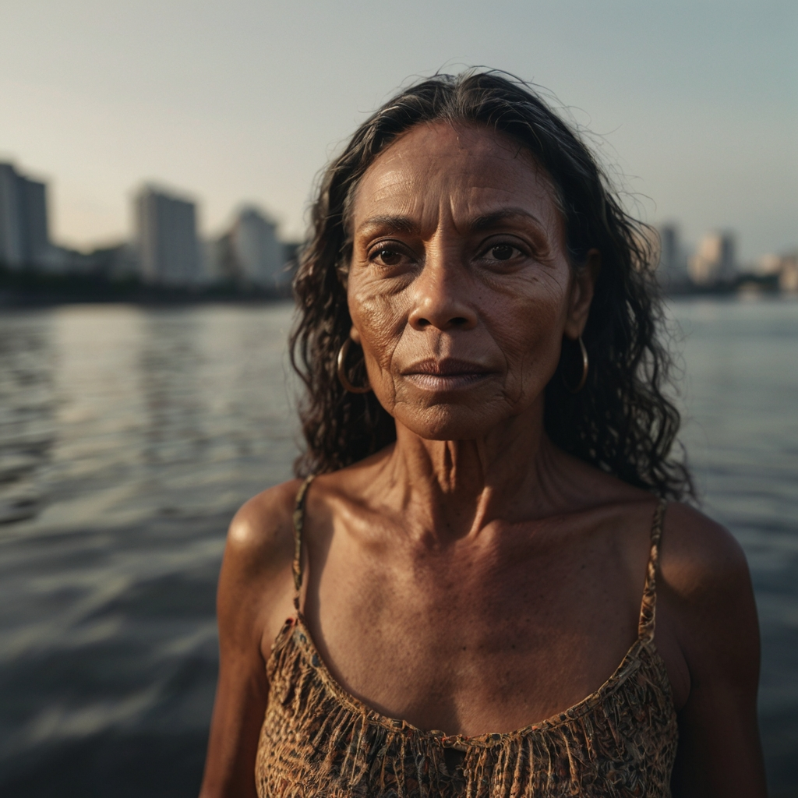

# Natural ou Fake Natty? Como Vencer na Era das IAs Generativas

> Woooow! Look at this 👀

# ✨ Projeto Aesthetic ✨

### 📒 Descrição
Este projeto explora a criação de conteúdos visuais altamente realistas usando IA Generativa. O objetivo foi desenvolver imagens e designs que capturam a estética desejada com a máxima precisão. O trabalho incluiu a experimentação com diferentes prompts para otimizar a qualidade e realismo dos resultados, destacando como a escolha dos parâmetros pode influenciar significativamente a aparência final.

### 🤖 Tecnologias Utilizadas
- Leonardo.AI: Ferramenta principal para a criação dos conteúdos.

## 🚀 Resultados 

    
      
    Prompt: "Ultra realistic image of a Caucasian woman, 40 years old, a mole on her right cheek"

 

##

 

    
     
    Prompt: "A beautiful woman, with small spots on her skin, dark, long, wavy hair, with fair skin, with a look of surprise and happiness on her face, full lips and rosy cheeks"

 

##

 

### Mesmo prompt, mas com variações: um em inglês e outro em português respectivamente: 
 

    
    
     
    Prompt: "A 40-year-old woman with fair skin sitting on the riverbank washing clothes" 
    Prompt: "Uma mulher de 40 anos de pele clara sentada na margem do rio lavando roupas"

##

### 💭 Reflexão 
Ao comparar a utilização de prompts em inglês e português, observei diferenças significativas nos resultados. Utilizando o mesmo prompt em diferentes ferramentas de IA, percebi que os resultados foram insatisfatórios e menos realistas nas alternativas.

